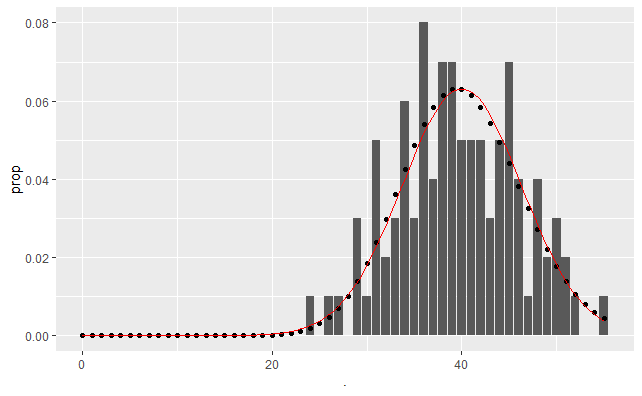
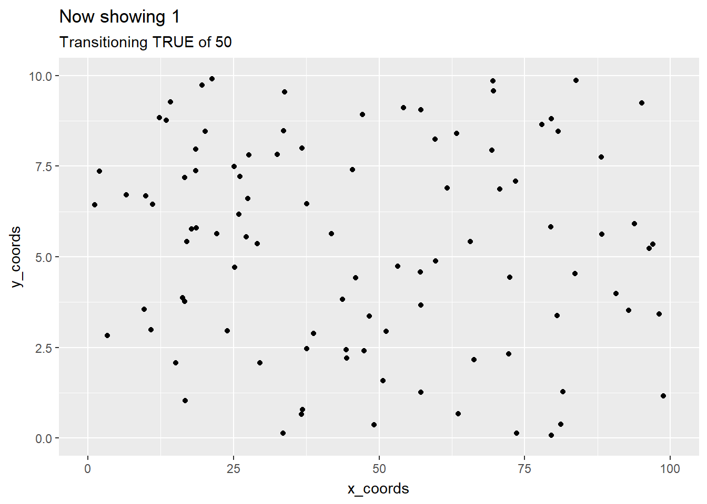
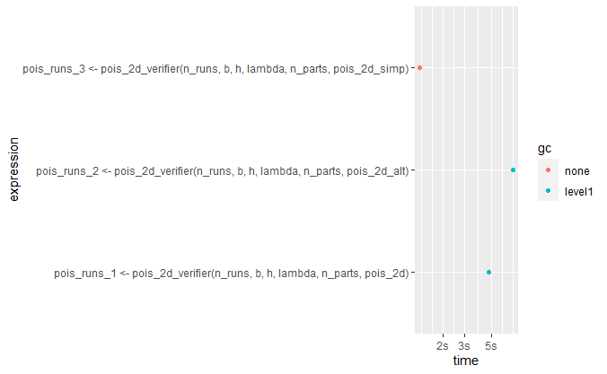

```{r setup, include=FALSE}
library(tidyverse)
library(pander)
knitr::opts_chunk$set(fig.height=4, fig.width=5, echo = TRUE)
```

\makeatletter
\let\ps@plain\ps@fancy
\makeatother

# Goal
The goal of this project is to simulate a 2D Poisson process on a rectangular region.

# Conceptual Understanding
## Definition
A process consisting of randomly occurring points in the plane is said to constitute a two-dimensional Poisson process having rate $\lambda$, $\lambda > 0$ , if 

1. The number of points occurring in any given region of area A is Poisson distributed with mean $\lambda A$.  
2. The numbers of points occurring in disjoint regions are independent.

## Converting a Poisson problem to an Exponential problem

Although the previous definition is the most natural, there are equivalent formulations that lend themselves to various contexts. Here the following theorem leads to straightforward implementation.

$\mathbf{Theorem}$ Starting with an area of 0, any additional area that needs to be covered before observing a new point is an independent Exp($\lambda$) RV.

One can think of this equivalence as saying the obvious thing: one can either integrate small pieces to get the whole, or differentiate the whole to get the incremental pieces.


# Implementation

## Approach 1: Follow the recipe in the *Simulation* book
A natural way to start is simply translate the previous equivalence to an algorithm, which can then be bound to the R language.

Specifically, we iteratively draw Exponential RVs representing the incremental areas until their sum exceeds the prescribed area of rectangle. Thanks to the simplicity of the geometry, these incremental areas are easily translated to the x-coordinates at which the Poisson points occur. Their y-coordinates can be assigned by drawing from a uniform distribution, as the conditional distribution of the y-coordinate, given the x-coordinate, follows a uniform distribution concentrated within the lower and upper geometric bounds (the lower and upper sides of the rectangle in this case).

In an R function, we only need to return the x-coordinates for now, and wait to generate the y-coordinates later. This can lead to efficiency gains if we are to simulate the 2D process over and over.

Moreover, in this approach, we do not know the number of occurrences ahead of time; this means that the vector holding the x-coordinates can theoretically grow no matter how much capacity is allocated initially. In practice, however, the number of occurence follow a Poisson distribution with a desired mean and variance. To improve on this efficiency aspect, we grow in chunks of size equal to the expected count, which will give an amortized O(1) run time associated with binding values to the vector. 

## Approach 2: Critical thinking -- can we assign the x-coordinates randomly?
In Approach 1, we compute the x-coordinates by dividing the incremental area by the height of the rectangle, which is anchored at the origin on its lower left corner. However, based on the definition of the Poisson process, the occurrence in any infinitesimal area is i.i.d.. That seems to imply that we could have assigned the x-coordinates randomly. To ascertain the veracity of this conjecture, we implement `pois_2d_alt` and verify its correctness. (Based on this idea, the y-coordinates can also be randomly assigned. But that is exactly we have done in approach 1! So no change is needed.)


## Approach 3: Synthesis -- let's further simplify things
If we are allowed to muster some confidence, it seems that all we need to know is the **total number** of Poisson points in a given area, and then their locations can be assigned uniformly. It then seems that the process of iteratively generating the Exponential RVs is unnecessary (and slow), when we can obtain the same information in one go: by drawing from a Poisson distribution with $\lambda A$ as the rate parameter! This also will save the time for growing the size of vector for x-coordinates.

Note that this third approach is essentially an "integrative one", as opposed to "differentiative", if this is even a word.

# Correctness Verification

While Approaches 2 and 3 might come off as a leap of faith, the proof of the pudding is in the eating. Oops, sorry, I meant that the proof of the conjectures is in the verification.

## Three sanity checks for an inherently random process
The things we are verifying are not the random components of the Poisson process, but rather the deterministic laws that govern the data-generating process. In light of this, we can  

- seek to recover the underlying distribution and verify that it adhere to a proper Poisson distribution;  
- tweak the parameters of the Poisson process and verify that the distribution morphs in expected ways;  
- Appeal to the more powerful law, CLT, by increasing the product $b * h * \lambda$ and verify that the resulting empirical distribution converge to an appropriate Normal distribution.

To verify also the "i.i.d." part (or at least the identicalness between disjoint regions), we also divide the region (rectangle) into disjoint parts and apply the three sanity checks to each of them. . In particular, the mean counts should reflect $b * h * \lambda / n_parts$, where $b$ = base, $h$ = height, $n_parts$ = number of partitions, and the asymptotic normal has mean and variance both equal to $b * h * \lambda / n_parts$.

Here is a sample picture for one disjoint subset on which the empirical distribution (bars) is set against the theoretical Poisson PMF (dots), along with the lurking normal distribution (red), in a small sample size (number of runs of the 2D Poisson process). For a collection of plots and numerical results reflecting the sanity checks, one can refer to the "Verifier" Markdown file (`pois_2d_verifier.Rmd`). (We have also extracted the verifier into a function, which can be called to verify for various parameters and implementations of the 2D Poisson process.)

{#id .class width=50% height=50%}

# Visualization
## Animating the 2D Poisson process
Once the implementation passes the correctness check, we are comfortable to visualize the Poisson process. 

We can directly use the runs of Poisson process from the "Verifier" in the "Animator" (by saving the simulations in the `results` folder), by stacking the runs on top of one another sequentially, making an animation. Ideally, if we render each of the runs at a uniformly chosen time within a fixed interval (say one second), we produce (exactly) a 2D process with a time axis. However, due to the restriction of `gganimate`, the runs are rendered at fixed times. This would then be an approxmiation of a Poisson process, in which time units are discretized.

To build up the static ggplot needed to feed the gganimate engine, we make use of functional programming in R, where a function factory is used to roll out `add_layer` functions, which keeps a state across the layer-building process, and the static ggplot can be retrieved by reaching out to the function's immediate environment. One benefit of this approach is that we can potentially build static ggplots for different Poisson processes with distinct parameters and are able to keep things separated/organized.

The animation is shown below.




# Timing Experiments
The above animation is done using the simulation outputs from the simplified implementation of the 2D Poisson process, because it's so much faster! We know this theoretically: Approach 2 should be slower than Approach 1, since it draws a uniform RV, instead of dividing the incremental ara by height, to compute an x-coordinate. But this serves as a proof-of-concept for a simplification in Approach 3, where all the uniform RVs are drawn at once. The timing plot demonstrates our expectations:

{#id .class width=100% height=100%}

**Note** Strangely, after changing the *n_chunks*, it seems that `pois_2d_alt` is actually faster than `pois_2d`. The reason is not clear.

# Documentation
All of the functions are documented using Roxygen as well as regular comments.

# Parting Thought
The original project proposal mentions approximating the 2D Poisson process by a 1D process. In doing the project, however, we have realized that there is no such thing. In fact, everything can be thought of as 1D per se: the point is that if we have a *measure* on a certain type of resource, be it length, area, volume, or time, the occurrence of the Poisson process is with respect to this measure, which is 1D, not the underlying space on which the said measure is defined.